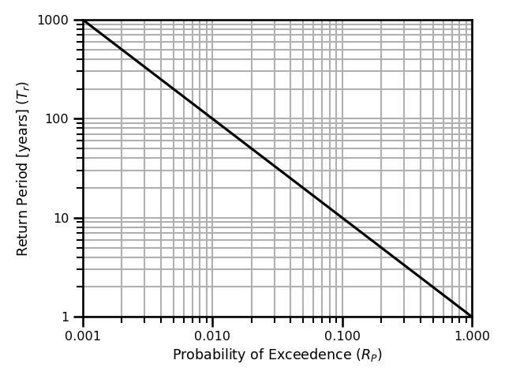
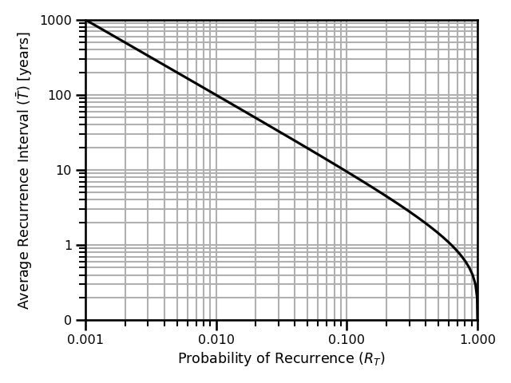
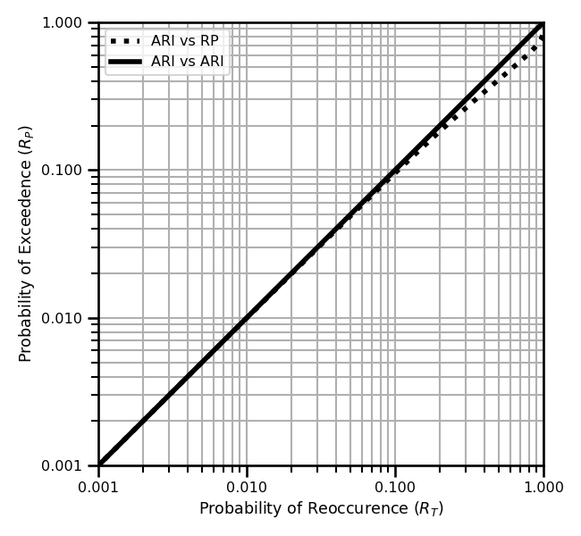
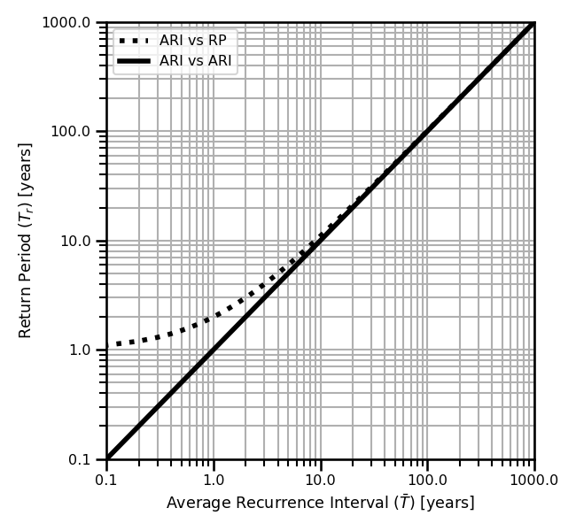

## Probability Density Function

> The probability that a variate, $Y$, has the value $y$.

$$
Pr[Y=y] := f(y)
$$ (eq:pdf)

***
## Cumulative Distribution Function

> The probability that a variate, $Y$, takes a value less than or equal to $y$.

$$
Pr[Y \leq y] := F(y)
$$ (eq:cdf)

***
## Survival Function

> The probability that a variate, $Y$, takes a value greater than $y$. 

$$
Pr[Y > y] = 1 - Pr[Y \leq y] = 1 - F(y) := S(y)
$$

***
## Quantile Function

$$
y_p = Pr[Y\leq y]
$$ 

We can write this as the quantile function

$$
y = F^{-1}(y_p):= Q(y_p)
$$ (eq:quantile)

***
## Inverse Survival Function

This is the same as the quantile function given in equation  except we set the probability equal to the survival probability

$$
y_p = 1 - y_s
$$ (eq:prob-survival)

***
## Return Period (RP) Function

This is the same as the quantile function given in equation  except we set the probability equal to the inverse survival probability.

The recurrence interval is a measure of how often an event is expected to occur based on the probability of exceeding a given stage streshold.
This threshold is called the *annual exceedance probability*.
To calculate this, we can express the return period (in years) as

$$
R(P) := R_p = \frac{1}{T_r}
$$ (eq:prob-return)

where $R_p$ is the annual exceedence probability (AEP) and $T_r$ is the number of years.
The AEP is has a domain between 0 and 1, $RP\in[0,1]$, and the return period has a domain between 1 and infinity, $R_P\in[1,\infty)$.
This can be limiting when we consider sub-annual probabilities which would be elements less than 1. 
In addition, it can be incorrect when there is some wrong interpolation between 100 and 1.

:::{figure}
:label: fig:prob-return
:align: left

A figure showing the return period `[years]` vs the probability of exceedance, $R_p$.
:::

***
### Usage

In practice, we can use this to calculate the return level given any arbitrary CDF function

$$
R_p = Pr[Y \geq y] = 1 - Pr[Y \leq y] = 1 - F(y; \boldsymbol{\theta})
$$

Once we solve this for the quantity $y$ in terms of $R_p$, we get the following relationship

$$
y_l = \boldsymbol{Q}(y_p;\boldsymbol{\theta})
$$

where $Q$ is the quantile function, i.e., the inverse CDF function, and $y_p = 1 - R_p = 1 - 1/T_r$.

***
## Average Recurrence Interval (ARI)

This is also known as the Mean Inter-Arrival Time or the Mean Recurrence Interval.

$$
R_T = 1 - \exp\left(- \frac{1}{\bar{T}}\right)
$$ (eq:prob-ari)

where $\bar{T}$ is the mean inter-arrival time measured in $years$.

:::{figure}
:label: fig:prob-return
:align: left

A figure showing the average recurrence interval `[years]` vs the probability of recurrence, $R_T$.
:::

***
### Derivation

We assume that we have a counting process, $N(A)$, which is a Poisson process with a rate of occurrence, $\lambda$.
Then the probability that there is at least 1 event in the time interval, $(0,T]$, is given as the survival function of the exponential distribution:

$$
Pr[N(A) \geq 1] = 1 - Pr[N(A)=0] = 1 - \exp \left(-\lambda T\right)
$$

where the mean inter-arrival time is given as

$$
\mathbb{E}[Y] = \frac{1}{\lambda} := \bar{T},
\hspace{10mm}
\bar{T}\in[0,\infty)
$$

The probability of at least 1 event  in the interval $(0,T]$ is given as

$$
Pr[N(A) \geq 1] = 1 - \exp \left(-T/ \bar{T}\right)
$$

and the probability that there is at least 1 event within 1 unit time interval is given as

$$
Pr[N(A) \geq 1] = 1 - \exp \left(-1/ \bar{T}\right)
$$

***
### Usage

In practice, we can use this to calculate the return level given any arbitrary CDF function

$$
R_T = Pr[Y \geq y] = 1 - Pr[Y \leq y] = 1 - F(y;\boldsymbol{\theta})
$$

Once we solve this for the quantity $y$ in terms of $R_T$, we get the following relationship

$$
y_T = \boldsymbol{Q}(y_p;\boldsymbol{\theta})
$$

where $Q$ is the quantile function, i.e., the inverse CDF function, and $y_p = 1 - R_T = \exp\left(-1/\bar{T}\right)$.

***
## RP vs ARI

There are some equivalences of these two quantities. 
Namely, we can write this as:

$$
\begin{aligned}
R_p &= R_T \\
\frac{1}{T_r} &= 1 - \exp\left(- \frac{1}{\bar{T}}\right)
\end{aligned}
$$

::::{tab-set}

:::{tab-item} Probabilities
:::{figure}
:label: fig:prob-return
:align: left

A figure showing the probability of occurrence, $R_T$, vs the probability of exceedence, $R_p$.
:::

:::{tab-item} Periods
:::{figure}
:label: fig:prob-return
:align: left

A figure showing the average recurrence interval `[years]` vs the return period, `[years]`.
:::

::::

So, we can easily plot one in terms of the other.
They are not equivalent because the return period, $T$, is bounded between $[1,\infty)$, and  the RHS, $R_T$, is bounded between $[0,\infty)$.

***
## Hazard Function

> The ratio of probability density function to the survival function, aka the conditional failure density function.

$$
H(y) = \int_{-\infty}^yh(\tau)d\tau = -\log\left(1-F(y)\right)=- \log S(y)
$$

## Counting Process

$$
\begin{aligned}
N(A) 
&= \#\left\{n\in\mathbb{N}^+: T_n \in A \right\} \\
&= \sum_{n=1}^\infty \mathcal{1}
(T_n \in A)
\end{aligned}
$$

***
### Survival Function

This is the probability that the time of death is later than some specified time, $t$.

$$
S(t) = Pr[T>t] = \int_t^\infty f(\tau)d\tau = 1 - F(t)
$$

***
### Lifetime Distribution Function

$$
F(t) = Pr[T\leq t] = 1 - S(t)
$$

***
### Event Density

This is the rate of death/failure events per unit time

$$
f(t) = F'(t) = \frac{d}{dt}F(t)
$$

***
### Survival Event Density

$$
\begin{aligned}
s(t) &= S'(t) = \frac{d}{dt}S(t) \\
&= \frac{d}{dt}\int_t^\infty f(\tau)d\tau \\
&= \frac{d}{dt}\left[1 - F(t) \right] \\
&= - f(t)
\end{aligned}
$$

***
### Conditional Intensity Function

This is the instantaneous rate of a new arrival of new events at time, $t$, given a history of past events, $\mathcal{H}_t$. 
This is also known as the hazard function.

$$
\lambda^*(t) = \frac{f^*(t)}{1-F^*(t)}
$$

We can rewrite this using th relationship of the survival function

$$
\lambda^*(t) = \frac{f^*(t)}{S^*(t)}
$$

We can also rewrite this using the relationship between the survival function and the cumulative hazard function

$$
\lambda^*(t) = \frac{f^*(t)}{\exp\left( -\Lambda(\mathcal{T}) \right)}
$$

***
### Probability Density Function

We can write the conditional probability density function in terms of the hazard and cumulative hazard function

$$
f^*(t) = \lambda^*(t) \exp\left( -\Lambda(T) \right) = \lambda^*(t)S^*(t)
$$ (eq:tpp-density)

We can also write it using the hazard function and the survival function

$$
f^*(t) =  \lambda^*(t)S^*(t)
$$ (eq:tpp-density-survival)

And lastly, we can write it in terms of the hazard function and the CDF function.

$$
f^*(t) =  \lambda^*(t)\left(1-F^*(t)\right)
$$ (eq:tpp-density-cdf)
